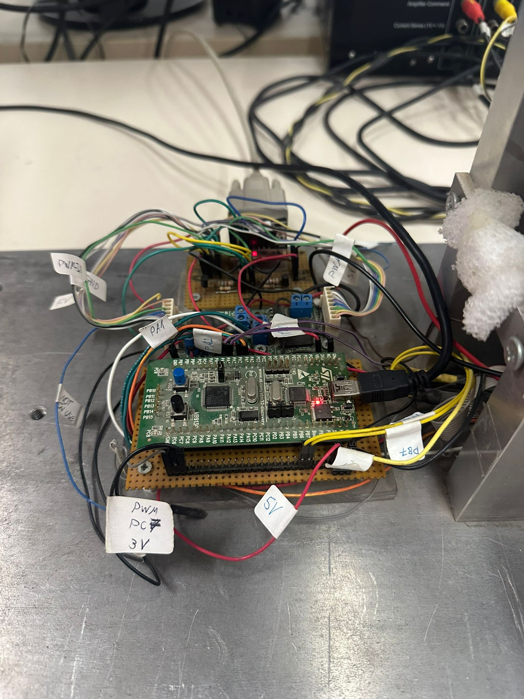
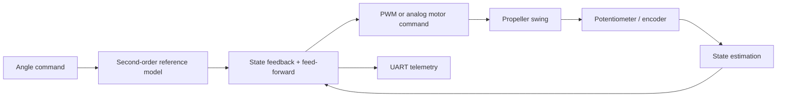

# STM32 Propeller Swing LQR

Embedded closed-loop control of a propeller-driven swing on an STM32F10x microcontroller. The firmware combines an identified plant model, a second-order reference model, state estimation, and an experimentally tuned LQR-inspired feedback law.

<p align="center">
  
</p>

**[Watch the 62-second closed-loop demonstration](assets/media/controller-demo.mp4)**

## Project overview

The controller drives two opposing propellers to track a commanded swing angle. Its implementation includes:

- STM32F10x firmware written in C
- PWM and analog actuator-output paths
- Potentiometer and quadrature-encoder sensing
- A filtered reference trajectory and finite-difference state estimates
- UART telemetry for live MATLAB/Simulink visualization
- Experimental response plots and a reproducible technical walkthrough

The repository preserves the original embedded implementation and organizes the supporting evidence around it. The primary technical reference is the [Jupyter notebook](notebooks/stm32_propeller_swing_lqr.ipynb).

## Control architecture

The identified open-loop plant and the desired reference dynamics are:

```text
             83.01                          400
G(s) = ------------------       F(s) = ------------------
       s² + 13.88s + 83.01               s² + 40s + 400
```

The implemented feedback uses the experimentally tuned gain vector
`K = [2.0, 1.25, -3.75, -0.6]` and feed-forward gain `Kff = 4`. The firmware estimates the required derivatives from sampled positions, combines plant and reference-model states, and maps the signed control effort to the two actuators.



## Hardware and I/O map

| Function | Peripheral | Pin(s) |
|---|---|---|
| Motor PWM | TIM3 | PC6, PC7 |
| Analog motor command | DAC | PA4, PA5 |
| Quadrature encoder | TIM4 | PB6, PB7 |
| Angle potentiometer | ADC1 | PA1 |
| Telemetry | USART2 TX | PA2 |

The code targets the STM32F10x standard peripheral library. Some board-specific setup is not present in this repository; see [Build status and limitations](#build-status-and-limitations).

## Reported experimental results

| Output mode | Rise time | Peak time | Steady-state error |
|---|---:|---:|---:|
| Analog | 2.610 s | 1.580 s | 24.618 counts (approximately 1.114°) |
| PWM | 2.065 s | 1.435 s | 68.322 counts (approximately 3.075°) |

These values are transcribed from the retained experimental evidence and are analyzed in context in the notebook. The demonstration video shows setpoint changes, physical tracking, and the corresponding live telemetry display; it does not independently identify which actuator-output mode was active.

## Repository structure

```text
.
├── assets/
│   ├── figures/       # Plant, calibration, response, and flowchart evidence
│   ├── images/        # Hardware photograph
│   └── media/         # Closed-loop demonstration video
├── include/           # Firmware headers
├── models/            # MATLAB/Simulink telemetry viewer
├── notebooks/         # Primary technical documentation
├── src/               # STM32 firmware sources
├── LICENSE
└── README.md
```

## Documentation and model

- [Technical notebook](notebooks/stm32_propeller_swing_lqr.ipynb) — system model, controller derivation, firmware mapping, evidence, results, and limitations
- [Simulink telemetry viewer](models/read_data_SWING.slx) — MATLAB/Simulink R2017a model for displaying four signed 16-bit telemetry channels over a serial connection
- [Controller flowchart](assets/figures/07-controller-flowchart.png)

The telemetry model was configured for COM1 at 9600 baud, 8 data bits, no parity, one stop bit, and little-endian byte order. It expects four `int16` values per 20 ms sample, framed by a line-feed header and a NUL terminator. Adapt the serial port and framing settings to the target environment.

## Build status and limitations

This repository is an archival, documentation-first firmware snapshot, not a standalone build package. It does not include a target IDE project, startup code, linker script, complete vendor library, or authoritative clock configuration. Integrating it into an STM32F10x project therefore requires board-specific work.

Important implementation constraints are documented in detail in the notebook. They include a potential PA1 ADC/UART pin conflict, blocking work inside the UART interrupt, a full-scale DAC conversion edge case, and timing assumptions that cannot be verified from the files currently available. The source is intentionally left unchanged so the documented implementation remains traceable to the experimental evidence.

## License

Released under the [MIT License](LICENSE).
