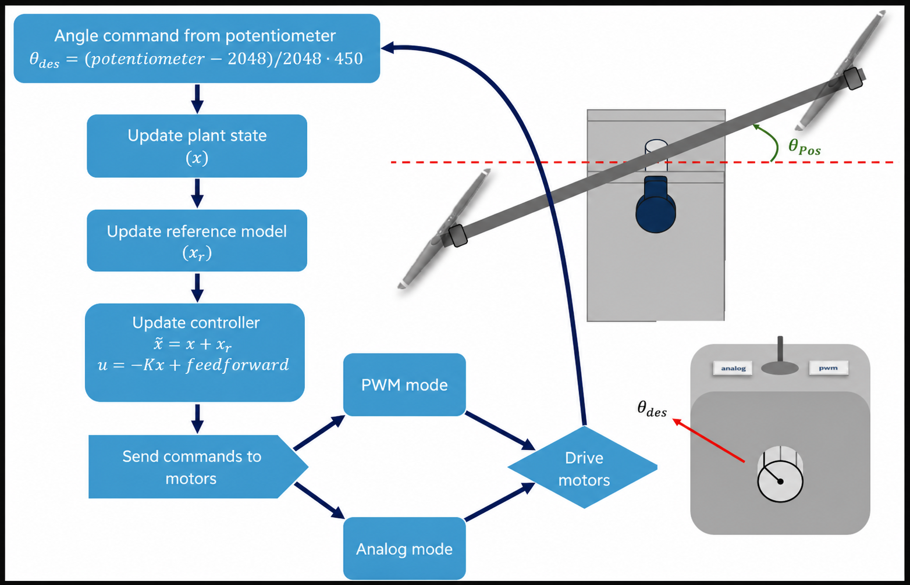
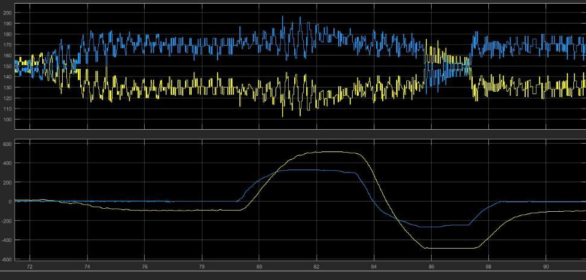
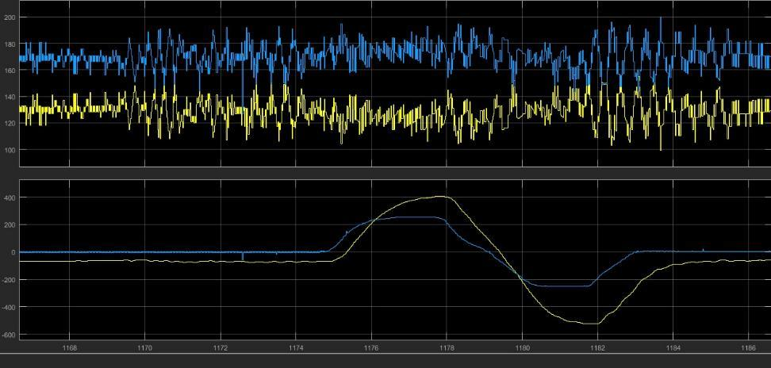

# Propeller Swing Control on STM32

**Embedded angle control for a two-propeller rotary arm**

Model-reference dynamics, LQR-derived state feedback, dual PWM/DAC actuation,
and serial telemetry implemented on an STM32F10x microcontroller.

[Engineering notebook](notebooks/stm32_propeller_swing_lqr.ipynb) &nbsp;&middot;&nbsp;
[Demo video](assets/media/controller-demo.mp4) &nbsp;&middot;&nbsp;
[Simulink monitor](models/read_data_SWING.slx)

## The system

Two opposing propellers rotate an instrumented arm around a central pivot. A
potentiometer sets the requested angle, an encoder measures the arm position,
and the STM32 closes the loop at a nominal 20 ms sample interval.

  

The firmware performs the following sequence on every control update:

1. Read the potentiometer command and encoder position.
2. Estimate angular velocity by finite difference.
3. Advance the second-order reference model.
4. Evaluate state feedback and feedforward.
5. Convert the signed control effort into complementary motor commands.
6. Transmit command and position data over UART.

## Controller

The measured open-loop response was approximated by

$$
G(s)=\frac{83.01}{s^2+13.88s+83.01}.
$$

The requested motion is shaped by the critically damped reference model

$$
F(s)=\frac{400}{s^2+40s+400}=\frac{20^2}{(s+20)^2}.
$$

The implemented controller uses

$$
u[k]=-K
\begin{bmatrix}x_1&x_2&x_{r1}&x_{r2}\end{bmatrix}^{T}
+K_{ff}\theta_d,
$$

with

$$
K=\begin{bmatrix}2.0&1.25&-3.75&-0.6\end{bmatrix},
\qquad K_{ff}=4.
$$

The gain is LQR-derived and was tuned on the physical apparatus. The complete
derivation, state-space models, discretization, calibration, actuator mappings,
and source-code correspondence are documented in the
[engineering notebook](notebooks/stm32_propeller_swing_lqr.ipynb).

## Experimental response

  
  

| Motor interface | Rise time | Peak time | Steady-state error |
|:--|--:|--:|--:|
| Analog | 2.610 s | 1.580 s | 24.618 counts (about $1.114^\circ$) |
| PWM | 2.065 s | 1.435 s | 68.322 counts (about $3.075^\circ$) |

These are reported experimental measurements. Raw samples are not available in
the repository, so the figures and metrics are preserved as evidence rather
than presented as newly reproduced results.

## Hardware interface

| Signal | STM32 peripheral | Pin(s) |
|:--|:--|:--|
| Motor PWM | TIM3 | PC6, PC7 |
| Analog motor command | DAC | PA4, PA5 |
| Quadrature encoder | TIM4 | PB6, PB7 |
| Command potentiometer | ADC1 | PA1 |
| Serial telemetry | USART2 TX | PA2 |

  

## Repository guide

| Path | Contents |
|:--|:--|
| [`src/`](src) | STM32 firmware implementation |
| [`include/`](include) | Firmware headers |
| [`notebooks/`](notebooks) | Primary engineering documentation and analysis |
| [`models/`](models) | MATLAB/Simulink serial telemetry viewer |
| [`assets/figures/`](assets/figures) | System, calibration, and response figures |
| [`assets/media/`](assets/media) | Physical closed-loop demonstration |

## Telemetry

The supplied Simulink model displays four signed 16-bit channels: both motor
commands, measured angle, and requested angle. Its recorded configuration is
COM1, 9600 baud, 8 data bits, no parity, one stop bit, and little-endian byte
order, with a nominal 20 ms sample period.

## Build status

> [!IMPORTANT]
> This repository contains the application firmware, not a complete standalone
> STM32 build project. Startup code, linker configuration, clock configuration,
> target project files, and the full STM32F10x vendor library must be supplied
> by the integrating project.

The notebook records the known implementation constraints, including the PA1
peripheral conflict, blocking UART work inside an interrupt, the DAC full-scale
conversion defect, and timing assumptions that cannot be verified from the
available files. The historical C implementation is intentionally preserved
unchanged.

## License

This project is released under the [MIT License](LICENSE).
